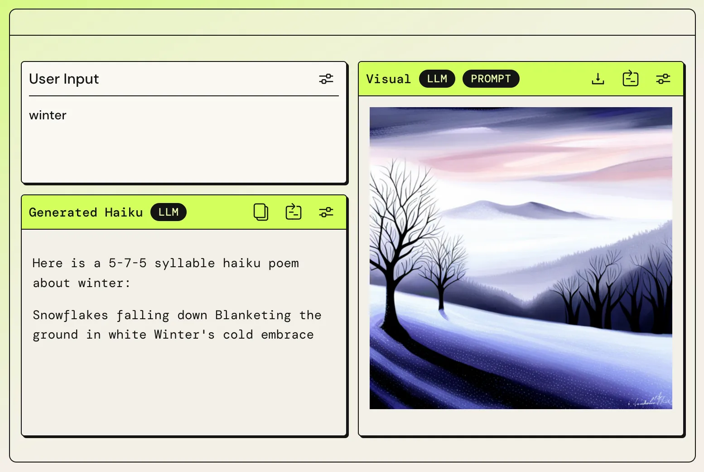
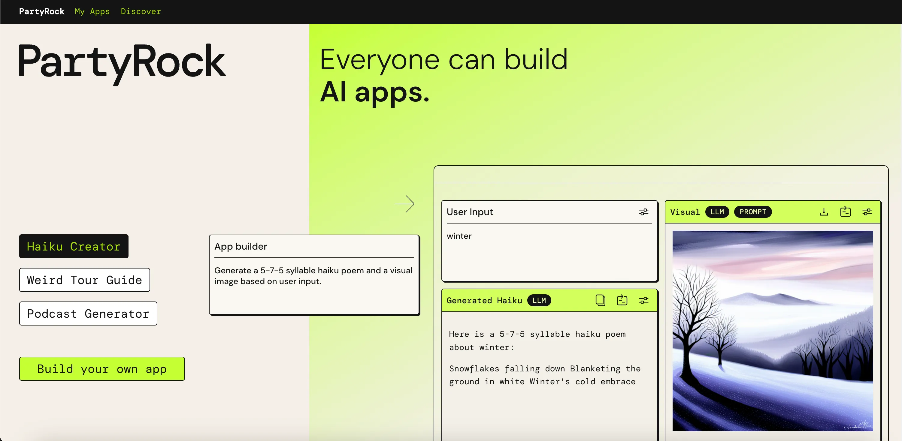
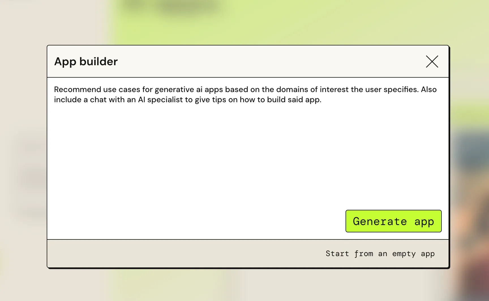
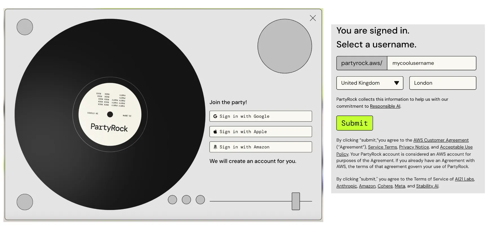
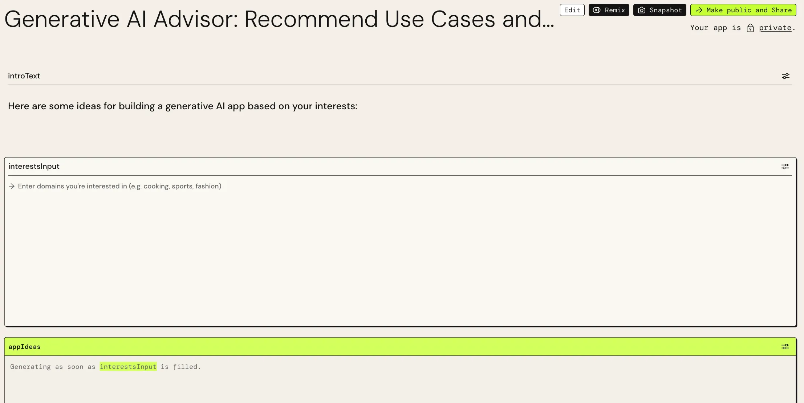
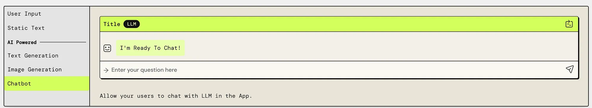
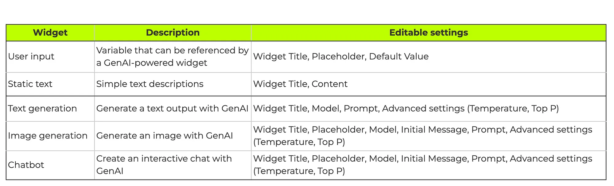
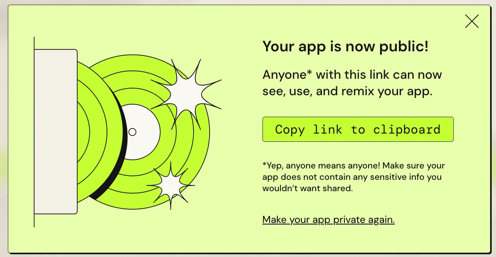
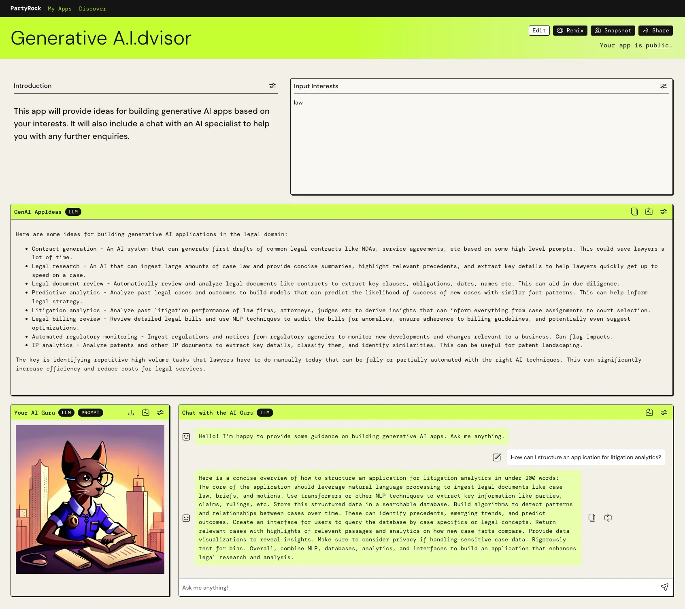

If you already use Generative AI technologies (such as ChatGPT or DALL-E) with some frequency, you might have started noticing patterns in what you ask the chatbots for. For instance, if you always want new haiku poems to impress your friends, having a template that takes in the theme would facilitate you getting a poem output faster, and prevent you from having to repeat yourself every time you'd like a new one.

  GenAI app example&nbsp;-&nbsp;Source: <a href="https://partyrock.aws/">PartyRock</a>

 

Perhaps you would also want to leverage GenAI to build your apps and share them with the world, but you don't want to spend hours taking care of the service instantiation, programming, and website hosting aspects of it.

If you resonate with any of those, or you just want to try out building an app in under 5 minutes, I would like to share with you a tool I came across recently, called **PartyRock**:

> "PartyRock is a fun and intuitive hands-on, generative AI app-building playground. In just a few steps, you can create a variety of apps to experiment with generative AI."
>
> \- _[Announcing PartyRock, an Amazon Bedrock Playground](https://aws.amazon.com/about-aws/whats-new/2023/11/partyrock-amazon-bedrock-playground/)_

It is a great way to create and share your AI-powered solution fast and with no code involved. It can also help you learn more about Generative AI and explore tools and settings in practice.

---

## Building your GenAI app in 5 easy steps

Let's now navigate to the [PartyRock website](https://partyrock.aws/) and create a new app with a few clicks in this follow-along tutorial.

### Step 1) Launch the app builder
Click 'Build your own app' (bottom left).

  PartyRock homepage&nbsp;-&nbsp;Source: <a href="https://partyrock.aws/">PartyRock</a>

 

### Step 2) Describe what you would like your app to do
Mine will return ideas for new apps based on my interests, but you input any other description you would like here.

Click 'Generate app' after writing the description.

> E.g.: Recommend use cases for generative ai apps based on the domains of interest the user specifies. Also include a chat with an AI specialist to give tips on how to build said app.

  Describing your app&nbsp;-&nbsp;Source: <a href="https://partyrock.aws/">PartyRock</a>

 

### Step 3) Log in to your profile
Log in using any Google, Apple, or Amazon account. If you're already logged in, your app will be generated automatically.

If you don't have a PartyRock profile yet, select a username and enter your location. You will then be able to generate your app.

  Signing in and selecting a username&nbsp;-&nbsp;Source: <a href="https://partyrock.aws/">PartyRock</a>

 

### Step 4 - optional) Edit and customize your app
PartyRock generates a first version of the app for you. It will look something like this:

  Automatically generated app&nbsp;-&nbsp;Source: <a href="https://partyrock.aws/">PartyRock</a>

 

You can now optionally tweak things further and edit widget settings and appearance (top right). If you do not wish to do that, skip to **Step 5**.

### Editing options
You can **change how widgets are displayed on the page (size and placement), and control the widgets' main settings.**

On editing mode, you can also **add new widgets** - once you click 'Add Widget', options will appear at the bottom of the page:

  Widget options you can choose from&nbsp;-&nbsp;Source: <a href="https://partyrock.aws/">PartyRock</a>

 

  Corresponding descriptions and settings&nbsp;-&nbsp;Learn more at: <a href="https://partyrock.aws/guide/building">PartyRock - Building Guide</a>

 

### Step 5) Share your app! 🎉
It's time to share your creation!

Click 'Make public and Share' (top right) to get a unique shareable link for your app. You can also switch it back to private whenever you'd like.

  Automatic link creation for your app&nbsp;-&nbsp;Source: <a href="https://partyrock.aws/">PartyRock</a>

 

## Final result
My app [Generative A.I.dvisor](https://partyrock.aws/u/grin/kxisv3nKr/Generative-A.I.dvisor) looks like this:

  <a href="https://partyrock.aws/u/grin/kxisv3nKr/Generative-A.I.dvisor">Generative A.I.dvisor on PartyRock</a>

 

I have edited it to use all 5 widget types and adjust the settings to what I needed. In the example above, I am requesting new app ideas for my interest in the legal domain.

I thought this was a highly useful answer with an extremely savvy-looking cat, so I can leverage PartyRock's feature to **snapshot and share a response**: [Snapshot #1 (input: 'law')](https://partyrock.aws/u/grin/kxisv3nKr/Generative-A.I.dvisor/snapshot/UDO9hXLNP).

A snapshot will include the version of the app at that given moment, all inputs, outputs, and generated images.

[Image -- The AI Guru appreciates you following this tutorial - Generated with PartyRock]

  The AI Guru appreciates you following this tutorial&nbsp;-&nbsp;Generated with <a href="https://partyrock.aws/u/grin/kxisv3nKr/Generative-A.I.dvisor/snapshot/UDO9hXLNP">PartyRock</a>

 

---

## Different ways to build
There are 3 ways to create an app with PartyRock. This tutorial showed the **Prompt method**, in which you write a description of what you want your app to accomplish, and AWS uses AI to interpret it via [Amazon Bedrock](https://aws.amazon.com/bedrock/) (AWS' service for GenAI Foundation Models). The description is sent as a prompt for a model capable of inferring what widgets and settings your app needs. PartyRock uses that information to put them together, and voilà! Your app is ready within seconds.

PartyRock also offers the **Remix method**, where you can make a copy of a pre-existing app and edit it at will, much like code playground solutions often do. This option offers a way to take inspiration from other builders, either on how the app is structured or on the app idea itself. On the technical side, it also enables one to work backward by tweaking pre-defined settings and understanding the impact of such changes.

The last one is the **Empty app method**, in which you start with a blank page and add whichever widgets you want. This is a good option if you already know how PartyRock works, and want the freedom to customize your app from the get-go.

---

## Why I love PartyRock
Having this tool that uses GenAI to standardize and facilitate the process of creating your own AI-powered app (a meta-tool if you will) really strikes me as a game changer.

I had reflected recently on the importance of having a layer between user and model to create purpose-specific GenAI applications in my previous article [Building a GenAI Solution](https://medium.com/lego-engineering/a-hackathon-success-story-using-generative-ai-f99ae4f09d88#:~:text=It%20is%20one%20of%20the%20main%20elements%20to%20help%20pivot%20your%20service%20from%20a%20generic%20Conversational%20Agent%20that%20takes%20in%20any%20instruction%20to%20the%20model%2C%20to%20a%20purpose%2Dspecific%20implementation.), and I really appreciate how PartyRock delivers just that, with the bonus of democratizing access to such technologies through its no-code approach.

Indeed, the user-centric approach is evident through the retro party website theme, and the simple process to create and customize one's GenAI application. Albeit minimalistic in front-end customization possibilities, it delivers elegant components with flexibility for readjustment, and the spotlight is on one's app's use case.

The 5-widget strategy, with 3 AI-powered ones, is also very appropriate for the targeted audience (→ anyone!). It offers enough to be complete but not too much to overwhelm. An app will typically be centered around the _text generation_ widget, which takes in the _user inputs_ to create the customized prompts. The _image generation_ provides the wildcard visual asset to make it fun, and the _chatbot_ gives dynamism to the app, making it interactive and providing the end user with support for their queries. Finally, _static text_ is the classic one to add descriptions here and there.

The PartyRock website also provides app examples, documentation, and community resources for builders wanting to learn more. Cost-wise, AWS states it is currently offering a free trial for a limited time, and there is a generous credit balance for input tokens, output tokens, and generated images. More information at: [PartyRock - Billing and Support](https://partyrock.aws/guide/faq#:~:text=a%20PartyRock%20App%3F-,Billing%20and%20Support,-How%20much%20does).

---

## App recommendations
### ⭐ PartyRock staff picks and most popular apps
- [PartyRock - Discover](https://partyrock.aws/discover)

### ⭐ My apps
- [Generative A.I.dvisor](https://partyrock.aws/u/grin/kxisv3nKr/Generative-A.I.dvisor): get ideas for building generative AI apps based on your interests.
- [Fridge2Recipe](https://partyrock.aws/u/grin/Nhdf1kOA5/Fridge2Recipe): get personalized recipe recommendations based on what you have available in your fridge.
- [TVRecbot](https://partyrock.aws/u/grin/1gjGZQU5W/TVRecBot): get personalized TV show recommendations based on your interests.
- [Weird Zoo](https://partyrock.aws/u/grin/qNnvrXR-m/Weird-Zoo): discover what a mix between two distinct animals would look like.

---

This article was originally published on my [Medium page](https://medium.com/@grinsteinmonique).
