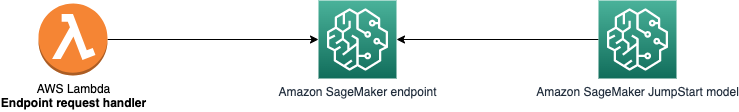
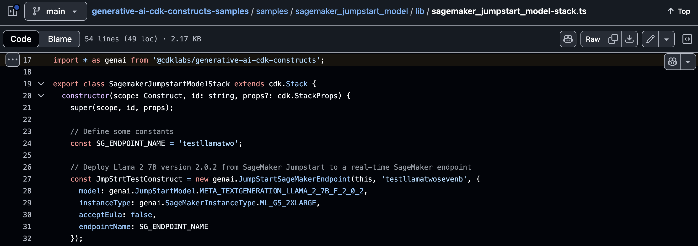

These are resources from my talk **"GenAI Made Easy for Devs - with AWS CDK Constructs"**, presented at the AWS Cloud Day Dublin 2024. Here you will find links to getting started with AWS CDK and offical AWS samples for your applications, particularly using AWS GenAI services.

---

### What is Infrastructure as Code
- [**AWS - Infrastructure as code**](https://docs.aws.amazon.com/whitepapers/latest/introduction-devops-aws/infrastructure-as-code.html)  
An introduction of Infrastructure as Code (IaC) and its importance in Software Development. Also includes summaries of the main AWS services for defining IaC.
 

### Getting started with AWS CDK
- [**AWS CDK Immersion Day Workshop**](https://catalog.us-east-1.prod.workshops.aws/workshops/10141411-0192-4021-afa8-2436f3c66bd8/en-US)  
If you never used CDK, I recommend starting here. You can choose to follow this tutorial in TypeScript, Python, or Go. If you also don't have an AWS account or never used the AWS CLI, the "Prerequisites" tab has tutorial links for those.
 

### Deploying official CDK examples from AWS

- [**AWS Samples - AWS CDK Samples**](https://github.com/aws-samples/aws-cdk-examples)  
Various examples of the CDK implemenatation of common services and architecture patterns.  

- [**AWS Samples - Generative AI CDK Construct Samples**](https://github.com/aws-samples/generative-ai-cdk-constructs-samples)  
Specific examples of Generative AI stacks built using AWS Generative AI CDK Constructs.
I recommend starting with the [SageMaker JumpStart Model](https://github.com/aws-samples/generative-ai-cdk-constructs-samples/tree/main/samples/sagemaker_jumpstart_model), which looks like this:

 

### CDK Constructs for GenAI

- [**AWS Generative AI CDK Constructs**](https://github.com/awslabs/generative-ai-cdk-constructs)  
This is the library containing CDK Constructs for common Generative AI application patterns. If you're building stacks that contain GenAI services (or leveraging the sample ones from AWS), you'll be importing said services from this library.   For instance, on the SageMaker JumpStart Model, the full library is imported as 'genai' (line 17), which is then used to instantiate a SageMaker Endpoint using Llama 2 as a model on an ML_G5_2XLARGE instance (lines 27-29).
 
[(source)](https://github.com/aws-samples/generative-ai-cdk-constructs-samples/blob/b33f50606e55a29e0b67cf9eebe4ae6be0bfc796/samples/sagemaker_jumpstart_model/lib/sagemaker_jumpstart_model-stack.ts#L17)

---