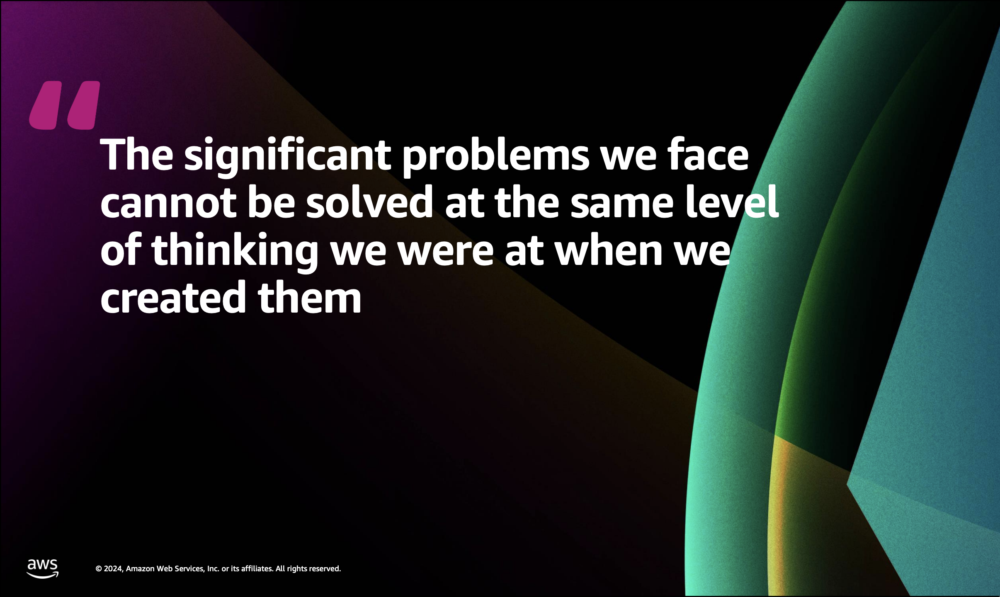

AWS re\:Invent 2024 brought a wealth of exciting announcements, particularly for developers. In this post, I share my top three DevTools that stood out, promising to streamline workflows, enhance debugging capabilities, and possibly revolutionize unit testing and code reviews. Read on to discover why these DevTools have me looking forward to an innovative 2025.

---

## 1. PowerTools for AWS Lambda (new features for TypeScript)
 If you're working with serverless, chances are you might have already used PowerTools at some point. At re:Invent, I had the chance to talk directly to the PowerTools developer team who were conducting a workshop for Python. I learned about new features that are not yet in the TypeScript implementation but are making their way in Q1, including: 

 - **OpenAPI Spec Generation**: This feature will simplify the process of documenting and integrating APIs by generating OpenAPI specifications directly from your code.
 - **Router**: TypeScript will soon benefit from this feature, which has already proven useful in the Python version. While I’ve traditionally been a fan of micro-functions, I’ve started exploring the advantages of Lambda monoliths in certain scenarios. I now look forward to testing the approach in TS.

## 2. AWS Toolkit for VSCode
When I was in Dublin to speak at AWS Cloud Day, Stephen Howell mentioned his upcoming talk at re\:Invent on the developer’s survival kit (DEV205), and of course I couldn't miss it. It was a great talk on various developer tools, and the one that stood out was the AWS Toolkit for VSCode. It’s packed with features that streamline serverless development, such as:

- **Invoking Lambda Functions Locally**: The toolkit allows you to pass test events directly through the IDE to invoke Lambda functions on AWS.
- **Local Debugging for Serverless Applications**: Using Docker, the toolkit creates a container that mimics the AWS Lambda runtime environment. This means you can set breakpoints, inspect variables, view the call stack, and step through your code—all locally.

## 3. Amazon Q Autonomous Agents for Unit Tests and Code Reviews
I’m skeptical about this one. I was genuinely surprised during Matt Garman's keynote when he categorized tasks like code reviews and test case creation as "undifferentiated" activities to be delegated to AI agents, as opposed to the "value-added activities" developers should focus on. I hold a different view: good reviews and a robust set of test cases are essential components of delivering value as a developer and decision-maker in the systems that are being built.

If an AI could truly handle those tasks robustly, consistently, and innovatively, then it would likely be capable of handling almost anything — running departments, companies, and ultimately replacing humans for every task. At that point, we’d essentially have AIs applying game theory until they "break the matrix".

I might be over-extrapolating on this one, but in my experience, high-quality code reviews and thoughtful test cases are non-negotiable and non-trivial in companies building innovative applications. But perhaps for other types of work, particularly where speed and scale are prioritized, these tasks are more like chores and could indeed be auto-generated.

 So setting aside sci-fi scenarios and dramatics, I would still welcome an AI tool that could reliably assist with code reviews and test case generation, provided it meets my quality standards and that I can easily review their outputs. Unfortunately, the tools I’ve tried so far have fallen short, producing either broken reviews or irrelevant test cases. That said, I haven’t yet tried Amazon Q, so I’m optimistic that AWS might prove me wrong. This year, I’m planning to put it to the test.

---

## Final Thoughts

These are just a few of the DevTools I’m excited about as we enter 2025.
 
Hope they are also useful to you, and happy building!

  Quote from chalk talk DEV205 at AWS re:Invent 2024.

 